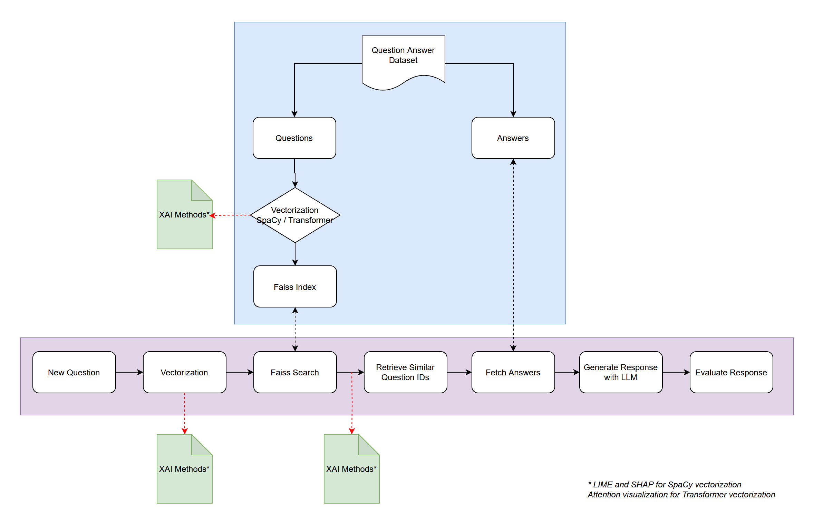

# Exploring the Black Box: An Analysis of Explainable AI

## Overview
This repository contains the research and implementation code for my master's thesis that focuses on developing a question-answering system with integrated Explainable AI (XAI). The system is designed to efficiently retrieve relevant answers from a dataset and provide explanations for its decisions.

## System Architecture
Below is the system architecture diagram that outlines the workflow of the question-answering process:

## Features
- Question vectorization using spaCy and Transformer-based models
- Efficient similarity search with FAISS indexing
- Integration of Large Language Models (LLMs) for answer generation
- Application of XAI methods for transparency in decision-making

## Components
- Dataset: 
